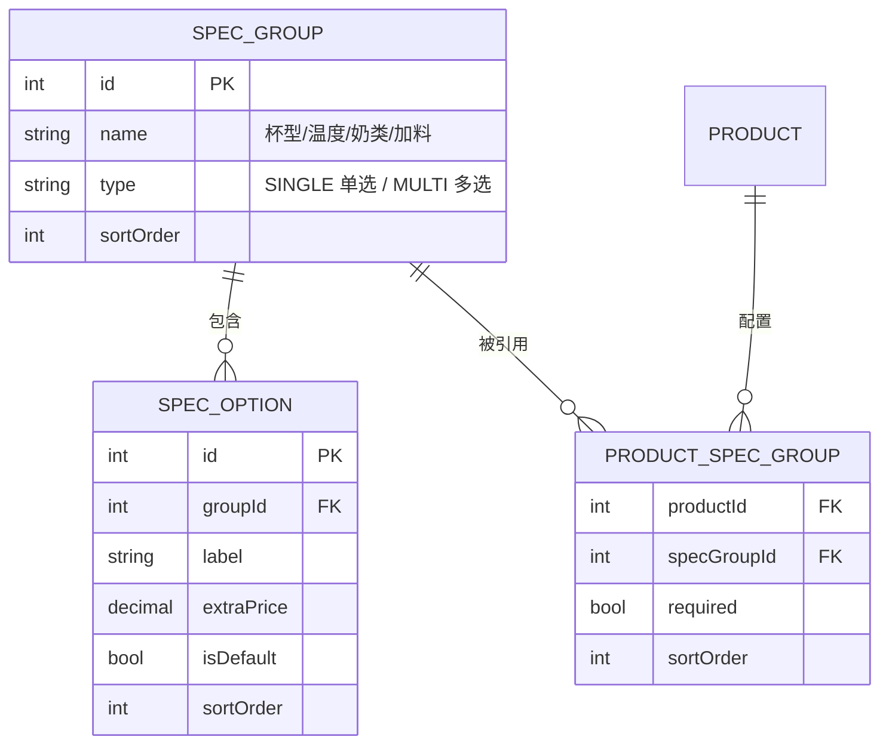

# Coffee Order · 产品体验与系统优化方案（评审稿）

> 状态：评审通过 · 迭代 A/B 已实施，迭代 C（安全纵深/会员）待排期  
> 日期：2026-08-15  
> 来源：试用反馈 14 项  
> 目标：先把「进店 → 点单 → 支付 → 出餐」闭环做顺，再补商家端效率与安全纵深

---

## 0. 设计原则

1. **商家零开发知识**：所有后台配置走可视化表单，不出现 JSON。
2. **数据模型先行**：规格、管理员、审计等结构化改造一次到位，避免二次返工。
3. **金钱与权限优先**：涉及支付、退款、订单状态的部分按最高安全标准处理。
4. **先体验后规模**：P0 聚焦点单闭环与基础后台，P1 做数据与协作，P2 做纵深安全与增长。

---

## 1. 需求分级总览

| # | 反馈问题 | 方案关键词 | 优先级 |
| --- | --- | --- | --- |
| 1 | 增加招牌/热销/全部类别 | 商品标记 + 快捷筛选 Tab | P0 |
| 2 | 类别过多左右滑动体验差 | 顶部分类入口 + 底部抽屉分类面板 | P0 |
| 3 | 加购应弹窗而非跳转 | 商品规格弹层（Spec Sheet） | P0 |
| 4 | 规格缺默认值，不能直接下单 | 规格选项默认值 + 必填组自动选中 | P0 |
| 5 | 规格 JSON 加载卡顿/难维护 | 规格结构化建模，去 JSON | P0 |
| 13 | 商家不会编辑 JSON 规格 | 可视化规格编辑器 | P0 |
| 12 | 商品太多难找 | 商品搜索 + 分类/状态筛选 | P0 |
| 8 | 堂食切换丢失座位 | 堂食态保持/即时选桌 | P0 |
| 10 | 商家登录页不居中不兼容 | 登录页弹性居中 + 响应式 | P0 |
| 11 | 看板指标不可跳转 | 指标卡片点击跳转 + Tab 定位 | P0 |
| 9 | 订单状态样式乱 | 步骤条流程组件重做 | P1 |
| 14 | 统计数据单一 | 趋势/占比/退款/时段等扩展 | P1 |
| 6 | 缺管理员配置与并发顾虑 | 账号角色 + 审计日志 + 原子状态流转 | P1 |
| 7 | 支付/资金安全 | 全链路安全分层加固 | P0/P1/P2 |

---

## 2. 核心数据模型重构（重点）

覆盖反馈 #5、#13，同时为 #1、#6 打基础。

### 2.1 规格系统去 JSON 化

**现状问题**

- 规格存在 `products.specsJson` 字符串里，商品详情每次 `JSON.parse`，带来可感知的页面卡顿。
- 商家端编辑的是裸 JSON 文本，不懂开发根本没法改。

**目标模型**

要点：

- 规格组与选项做成**可复用**模板，多商品共享「杯型/温度/奶类/加料」，商家只需配置一次。
- `spec_options.is_default` 解决 #4 的默认值问题；`required` 决定是否必选。
- `spec_groups.type` 区分单选/多选，替代现在的 `multiple` 约定。
- 订单明细 `order_items.specs_detail` **保留 JSON 字符串**：它是下单时的不可变快照，不改价也不回溯，合理且必要。
- 商品表移除 `specsJson`，新增 `is_signature`、`is_hot`（支撑 #1）。

**迁移**

- 写一次性脚本：读取现有 `specsJson` → 生成/复用 `spec_groups`、`spec_options` → 建立 `product_spec_groups` → 删除旧字段。

**前端收益**

- 菜单接口一次返回商品 + 完整规格树，详情页不再二次解析 JSON，消除卡顿。
- 菜单页即可直接弹规格层加购（#3），不需要回详情页。

### 2.2 管理员与审计（#6）

- `admins` 增加 `status`（启用/禁用）、`role` 细化为 `MANAGER / STAFF`。
- 新增 `audit_logs`：记录订单状态变更、退款审核、商品/设置修改、管理员增删，含操作人、时间、前后值。
- **并发一致性**：订单状态流转改为「带条件的原子更新」（`updateMany where id=? and status=预期旧状态`），同一订单被两个店员同时接单时只有一个成功；退款审核同样做状态前置校验。
- 数据错乱的另一个来源是编辑冲突：商品/设置采用「最后写入 + 审计留痕」，MVP 阶段足够，后续可选乐观锁（`version` 字段）。

---

## 3. 分项方案

### #1 招牌 / 热销 / 全部（P0）

- 商品加 `is_signature`、`is_hot` 两个布尔标记，商家端可视化开关。
- 顾客端分类最前插入三个快捷 Tab：`全部 / 招牌 / 热销`，`全部` 展示所有上架商品，`招牌`、`热销` 按标记过滤，之后是真实分类。
- 热销后续可升级为按销量自动计算，MVP 用手动标记，成本低、可控。

### #2 分类导航（P0）

- 顶部固定一行：左侧「当前分类 ▾」触发**底部抽屉**，右侧保留 `全部/招牌/热销` 快捷芯片。
- 抽屉内是纵向可滚动的分类列表 + 顶部搜索，每项大点击区域、当前项高亮；选完自动收起。
- 分类芯片样式重做：胶囊 + 更大点击热区、选中态用品牌深色实底，未选中浅色描边，避免现在「看不清、点不准」。
- 这样既不压缩商品展示区，又能容纳大量分类。

### #3 加购改弹窗（P0）

- 商品卡片右下「＋」不再跳详情，改为拉起底部 **Spec Sheet**（与详情页共用组件）。
- 弹层内容：商品名/价格、规格组（默认值已选中）、数量步进器、备注、底部「加入购物车」。
- 点商品卡其他区域仍进详情页（看大图/风味介绍）。

### #4 规格默认值（P0）

- 服务端在菜单接口返回规格时带上 `isDefault`；前端渲染时：
  - `required` 单选组自动选中默认项（无默认则第一个），
  - 多选组默认全空，价格按已选项实时计算。
- 效果：打开弹层/详情即可直接加购，不必逐项点选。

### #5/#13 规格可视化编辑（P0，随 2.1 一起做）

- 商家端商品编辑页改为结构化的「规格配置器」：
  - 从规格模板库勾选组（杯型/温度/奶类/加料…），也可新建组；
  - 组内选项表格：名称、加价、默认值勾选、排序、删除；
  - 支持单选/多选切换、是否必选。
- 彻底移除 JSON 文本框。

### #12 商品搜索与筛选（P0）

- 商品管理顶部加：搜索框（名称/英文名/风味）、分类下拉、状态筛选（在售/售罄/下架）、按创建时间排序。
- 服务端 `GET /admin/products?keyword=&categoryId=&status=` 过滤，避免前端一次性加载全部。

### #8 堂食座位保持（P0）

- 用户状态持久化到 `localStorage`：堂食/外带、已选桌号。
- 首页切换「堂食」时：
  - 已有桌号 → 显示「堂食 · A08 ▾」，可点重新选；
  - 无桌号 → 自动弹出选桌浮层，选完回到首页。
- 扫码进入自动绑定桌号仍保留，手动切换不再丢座。

### #10 登录页居中与兼容（P0）

- 登录页容器改为全屏 `flex` 居中，表单卡片设置 `max-width` 与内边距，适配手机/平板/桌面。
- 处理 iOS 安全区（safe-area）、键盘弹出、超小屏高度滚动。

### #11 看板指标跳转（P0）

- 今日营业额 / 订单数 → 订单管理；客单价 → 数据统计；待接单 → 订单管理并定位「待接单」Tab。
- 通过路由参数 `?tab=PAID` 等实现直达目标 Tab。

### #9 订单状态步骤条（P1）

- 重做为横向流程步骤条：`已支付 → 制作中 → 待取餐 → 已完成` 四个节点，节点用连线串联。
- 已完成节点绿色对勾，当前节点品牌色填充 + 轻微动效，未来节点灰色。
- 取餐码放大置顶；当前状态一句话文案（如「正在制作，预计 10 分钟」）放在步骤条下方统一说明，去掉现在不协调的小字标签。
- 退款/取消状态单独用醒目的状态卡展示，不混进正常四步。

### #14 数据统计扩展（P1）

在现有营收/热销/时段基础上补充：

- 营收趋势折线（近 7/30 天）、日环比/周同比；
- 品类销售占比（饼图）、单均商品数、退款金额与退款率；
- 时段热力（小时 × 星期，P1 后）；
- 售罄频次统计（辅助备货）；
- 会员相关（复购率/新老客）留到会员体系上线后。
- 数据导出 Excel 作为独立小项同步排期。

### #6 管理员配置与并发（P1）

- 商家端新增「管理员」页：创建/编辑/禁用账号、分配 `MANAGER/STAFF` 角色。
- `STAFF` 只允许订单接单/出餐/完成、售罄开关；`MANAGER` 额外拥有商品/桌台/设置/退款/管理员管理。
- 配合 2.2 的审计日志与原子状态流转，保证多人操作有据可查、不双接单、不双退款。

### #7 安全整体方案（分优先级）

**P0（上线营业前必做）**

- 支付：微信支付回调验签、金额二次校验、幂等处理；订单金额一律服务端重算，前端只传商品与规格。
- 传输：域名备案后全站 HTTPS + HSTS；Nginx 加安全响应头（X-Content-Type-Options、X-Frame-Options、CSP）。
- 权限：接口鉴权覆盖所有 `/admin` 写操作；状态流转做原子校验；退款必须审核人留痕。
- 口令：管理员密码强度校验 + bcrypt 成本提升；登录失败限流与短时锁定；默认 `admin/admin123` 首次登录强制改密。
- 数据库：MySQL 容器不暴露 3306 到公网，只内网访问；强密码；每日自动备份 + 保留多份。

**P1**

- 接口级限流（express-rate-limit），防刷与防暴力破解；请求体大小/字段白名单校验。
- 上传文件严格校验（类型/大小已做，补恶意内容检测）。
- 操作审计日志（与 #6 一起做）；敏感信息（手机号）展示脱敏。

**P2**

- 依赖定期更新与漏洞扫描；异常监控告警（服务宕机、支付失败激增）；异地/对象存储备份；登录态升级（refresh token + httpOnly cookie，如切 cookie 则补 CSRF 防护）。

---

## 4. API 变更清单

| 端点 | 变更 |
| --- | --- |
| `GET /api/categories` | 返回含规格树的商品，规格带 `isDefault/required/type` |
| `GET /api/products/:id` | 同上，改用关联查询 |
| `GET /api/admin/spec-groups` | 新增：规格组/选项模板 CRUD |
| `POST/PUT /api/admin/products` | 提交 `specGroupIds` + 配置，取代 `specsJson` |
| `GET /api/admin/products` | 增加 `keyword/categoryId/status` 过滤 |
| `GET /api/admin/admins` + CRUD | 新增：管理员管理 |
| `GET /api/admin/audit-logs` | 新增：审计日志 |
| `GET /api/admin/stats/*` | 扩展趋势/占比/退款等维度 |
| 状态流转 | 改为原子条件更新，返回冲突提示 |

---

## 5. 前端组件/页面变更

- 新增 `SpecSheet.vue`：菜单加购 + 详情页共用的规格弹层。
- 新增 `CategoryDrawer.vue`：底部抽屉分类面板（含搜索）。
- 新增 `ProductSpecEditor.vue`：商家端可视化规格配置器。
- 新增 `StepBar.vue`：订单状态流程步骤条。
- 重做 `pages_admin/login` 布局；看板指标加跳转；商品管理加搜索/筛选；统计页扩展图表。

---

## 6. 任务拆解与排期建议

**迭代 A（P0 · 点单体验闭环，约 5–7 天）**

1. 规格数据模型重构 + 迁移 + 种子数据（#5/#13 底座）
2. 商品标记与分类接口（#1、#4）
3. 顾客端：分类抽屉、加购弹窗、默认规格、堂食座位保持（#2/#3/#8）
4. 商家端：可视化规格编辑器、商品搜索、登录居中、看板跳转（#13/#12/#10/#11）

**迭代 B（P1 · 商家端效率与数据，约 4–6 天）**

1. 管理员角色 + 审计日志 + 原子状态流转（#6）
2. 订单步骤条 UI（#9）
3. 统计扩展 + 数据导出（#14）

**迭代 C（P2 · 安全与增长，随备案/会员节奏）**

1. HTTPS/域名 + 安全响应头 + 限流 + 备份自动化（#7 的 P0 项应提前并入迭代 A 收尾）
2. 会员/储值/复购统计
3. 依赖扫描、监控告警、云存储

> 说明：#7 安全项中标注 P0 的部分（支付校验、HTTPS、权限、密码策略）必须在正式营业前完成，建议与迭代 A 并行排期。

---

## 7. 需要你确认的决策点

1. **规格重构范围**：建议直接上「可复用规格模板」模型（改动较大但一次到位）；若希望先快后稳，可退化为「仅做可视化编辑器、内部仍存 JSON」——不推荐，因为卡顿与维护问题仍在。
2. **热销口径**：先手动标记，还是直接按近 30 天销量自动计算？建议先手动 + 后台可改，后续切自动。
3. **管理员角色粒度**：`MANAGER/STAFF` 两级够用，还是需要更细（如只读店员）？建议两级。
4. **统计报表范围**：先做营收趋势/品类占比/退款率三项，还是全量？
5. **迭代顺序**：是否同意按「迭代 A → B → C」推进，安全 P0 项穿插在 A 中？

---

*方案确认后，我再按迭代 A 开始拆分具体开发任务并实现。*
